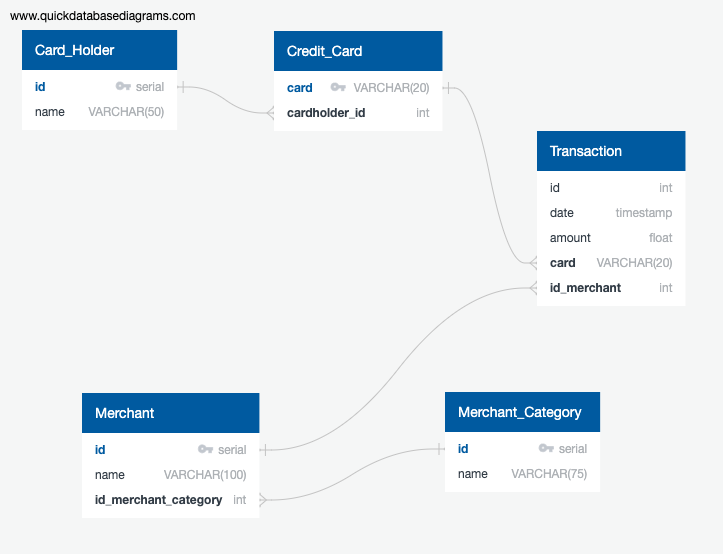
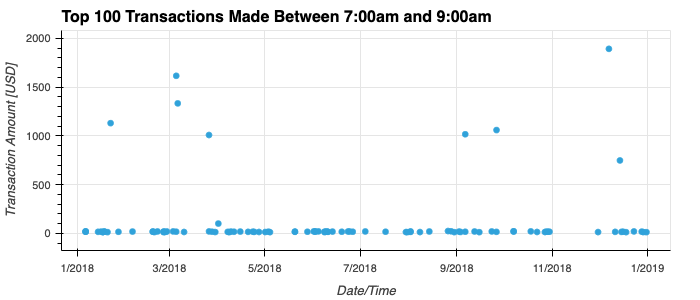
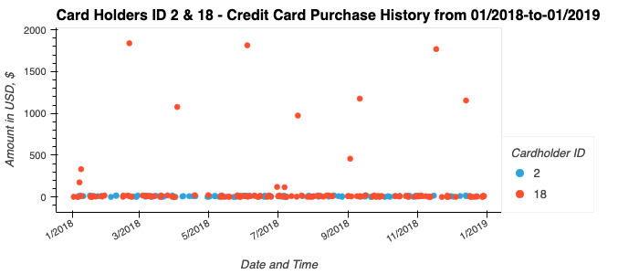
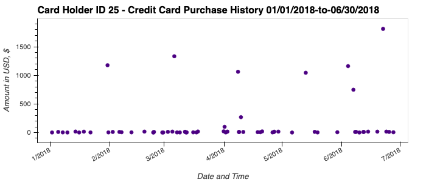
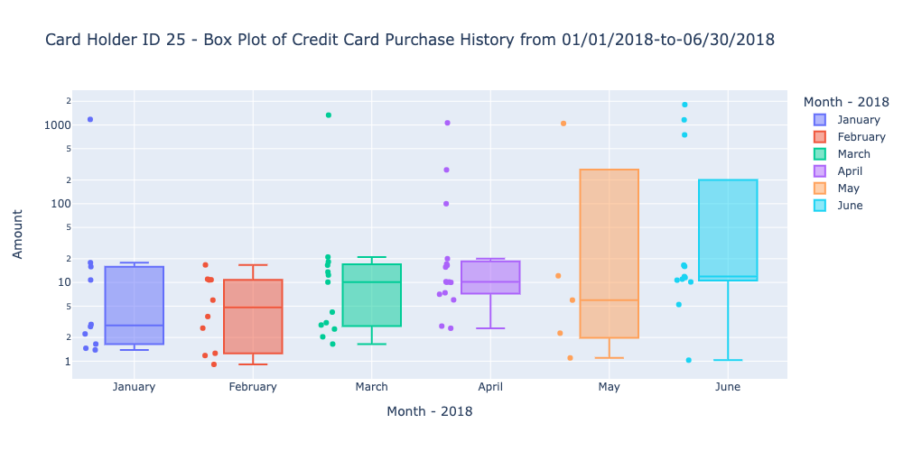

# <b> Module-7-Challenge </b>

## <b> SQL Business Data Analytics in Fraud Prevention </b>

## --------

## Overview

The purpose of the the two programs included in this git package are to utilize a SQL & Python symbiosis to analyze historical credit card transactions and consumption patterns
in order to identify and potentially react to fraudulent expenditures.

## Features

The main tasks outlined in this project will include:

1.) Developing an ERD (Entity Relationship Diagram) in Quick Database Diagram to map the relationships of five credit card/transaction/merchant data tables together
via primary & foreign key relationships. \* Note: (Refer to /Module-7-Challenge/QDBD_Files/QuickDBD-module_7_challenge_qdbd.png / .pdf for ERD visual files. Additionally, all queries utilized in SQL PgAdmin can be found in the RAW form in the cohesive /Module-7-Challenge/query1.txt file). (See Figure 1 below).

2.) Generate a database model in PostgreSQL PgAdmin based on the ERD previously constructed.

3.) Create a database schema on PostgreSQL PgAdmin in order to generate queries to import into python based on the original .csv files. \* Note: The primary SQL file containing all updated table drops/creations & applicable queries is found at /Module-7-Challenge/fraud_detection_01_all_tables_all_queries_updated.mssql, while supplementary and partial seed query sql files include /Module-7-Challenge/fraud_detection_final_query.mssql and /Module-7-Challenge/fraud_detection_01_all_joins.mssql.

4.) Analysis of the data in order to attempt to identify possible fraudulent transactions via trends or outliers.

5.) Develop conclusions based on these observations and include in this report.

## Data Analysis Results and Observations

### <u>ERD & SQL Tables:</u>

 

    

### <u>Primary SQL Generated Query to Import All Tables Linked Via Primary & Foreign Keys:</u>

 

#### <u>a.) SQL Table & Query Gens</u>

 

DROP TABLE IF EXISTS card_holder;
DROP TABLE IF EXISTS credit_card;
DROP TABLE IF EXISTS merchant_category;
DROP TABLE IF EXISTS merchant;
DROP TABLE IF EXISTS transaction;

CREATE TABLE card_holder (
id serial,
name character varying (50) NOT NULL,
PRIMARY KEY (id)
);

CREATE TABLE credit_card (
card VARCHAR (20) NOT NULL,
cardholder_id serial NOT NULL,
PRIMARY KEY (card),
FOREIGN KEY (cardholder_id) REFERENCES card_holder (id)
);

CREATE TABLE merchant_category (
id serial NOT NULL,
name VARCHAR (75) NOT NULL,
PRIMARY KEY (id)
);

CREATE TABLE merchant (
id serial NOT NULL,
name VARCHAR (100) NOT NULL,
id_merchant_category int NOT NULL,
PRIMARY KEY (id),
FOREIGN KEY (id_merchant_category) REFERENCES merchant_category (id)
);

CREATE TABLE transaction (
id int NOT NULL,
date TIMESTAMP NOT NULL,
amount float NOT NULL,
card VARCHAR(20) NOT NULL,
id_merchant int NOT NULL,
FOREIGN KEY (card) REFERENCES credit_card (card),
FOREIGN KEY (id_merchant) REFERENCES merchant (id)
);
 
 

#### <u>b.) Primary SQL Tables Foreign & Primary Key Join Query</u>

 

SELECT ch.id,
ch.name,
cc.cardholder_id,
cc.card,
t.amount,
t.date,
t.id_merchant,
m.name,
m.id_merchant_category,
mc.name
FROM card_holder as ch
JOIN credit_card as cc
ON ch.id = cc.cardholder_id
JOIN transaction as t
ON cc.card = t.card
JOIN merchant as m
ON t.id_merchant = m.id
JOIN merchant_category as mc
ON m.id_merchant_category = mc.id

 

### <u>Small Transaction (Amount < $2.00) Isolation & Analysis</u>

 
Initially, the first method chosen to isolate and analyze small transactions across all groups was via the SQL query method. This was done initially and the converted .csv files were looked at to see if there was any obvious outlying pattern shifts in spending habits. However, upon first inspection, it appeared to be questionable whether purchase price discrepancies actually showed any correlation to fraudulent behavior (i.e. such as micro transactions made in quick succession after initial purchases, out of habit spending patterns, or outliers that could definitely be considered suspicious). Credit card transactions in general can have wide spread in price/amount. As well, defining outliers does not in fact take into consideration the randomization of assumed purchase behavior from the customer and/or merchant. However, outliers were analyzed and isolated with a few different methods.

 
The primary method used was to convert the main linked SQL database tables via primary/foreign keys into a workable database, filtered via 'Amount' less than $2.00 and then using Holoviews Plots (hvPlot), put into a workable scatter plot that was 'groupby' sorted via 'Cardholder ID'. This way, you had a quick, workable, & visual graph to look at any
obvious major outliers or obvious pattern shifts in 'Amount' expenditures.

 
By going through the drop-down table, based on Cardholder ID, it may warrant further analysis to look at the card activate with sporadic and non-randomized 'consistent' purchases. A few cards that hold potential of some fraudulent activity may include Cardholder ID 3, 6, 9, 17. Cardholder 10 also shows some patterns of potential strange transactional values between $1.80 and $1.95 at both pubs at restaurants, but nothing concrete. This is the same with Cardholder 18 (tight range of possibly curious micro transactions at pubs, food trucks and restaurants - (i.e. pub at 6:13am in the morning). Again, this is speculation and Cardholders should be notified to confirm.

Additionally, in terms of top 5 merchants that could potentially be prone to small transaction fraud are included in a series list (see visual_data_analysis.ipynb). They are:
i.) Wood-Ramirez (7), Baker Inc. (6), Hood-Phillips (6), Walker-Deleon and Wolf (5) and Atkinson Ltd. (5).

 

### <u>100 Highest Transactions Made Between 7:00 am and 9:00 am</u>

 
Next, an analysis was performed on the 100 highest transactions made between 7:00 am and 9:00 am. Here, we see there is more obvious major outliers - and by linking primary & foreign keys to link all data associations, we can see there is very possible evidence of credit card fraud in this case. Utilizing an interactive scatter plot to display all column data on each scatter point, there is evidence that Cardholder's 1, 9, 16, & 25 have been victim's of credit card fraud. Or, at the very least, warrant immediate further investigation. This was determined by high transaction amounts over $1000 in nature at merchant categories that included restaurants, bars and coffee shops. (I.e. Cardholder ID 9 [Credit Card ####3340] has apparently spent $1009 at a coffee shop at 7:41 am). This is without a doubt high probable card fraud. It is possible fraud occurs mainly during this interval in the morning as a result of people not paying attention, rushing to work and having less personal self-awareness to their outward environment or that it's a period when most people are not concerned with checking their transaction statements. (See Figure 2 below).

 

    

### <u>Potential Credit Card Fraud With Cardholder IDs 2 & 18</u>

 

Again, it appears highly probable that both Cardholder ID 2 & 18 have been subjected to card fraud, similar to those described above. Again, visual data graphing suggests there is high frequency and consistent restaurant, pub & coffee shop transactions occurring with totals between $1.00-$20.00. However, between both card holders, there are a total of 10 major outliers between the two - some transactions in excess of $1000. These seem highly unusual and should be investigated immediately - up to and including having the cards frozen. (See Figure 3 below).

 

    

 

### <u>Potential Corporate Credit Card Fraud With Cardholder ID 25</u>

 

Again, it appears highly probable that both Cardholder ID 25 has been subjected to card fraud, similar to 2 & 18 described above. There are a total of outlier transactions that appear to have totalled over $1000 and are departed significantly from their 1-3 standard deviations and mean values. This card should be halted immediately and cardholder 25 contacted. (See Figure 4 & 5 below).

    

 

    

 

## Challenge File(s)

\*Note: Refer to the challenge file concerning the outlier analysis using statistical analysis methods and quartile analysis and their results.

## Running the Project

Running the project can be accomplished by accessing the https://github.com/KristopherGit/Module-7-Challenge.git Git Repository and running each section sequentially.

## Dependencies

No other outside resources are required to run the project except a python engine / python program and the following imported libraries and modules:

import pandas as pd
import calendar
import hvplot.pandas
from sqlalchemy import create_engine
import psycopg2
import plotly.express as px
import plotly.graph_objects as go
import panel as pn
import panel.widgets as pnw
import holoviews as hv

## Contributors

C Ringwood
